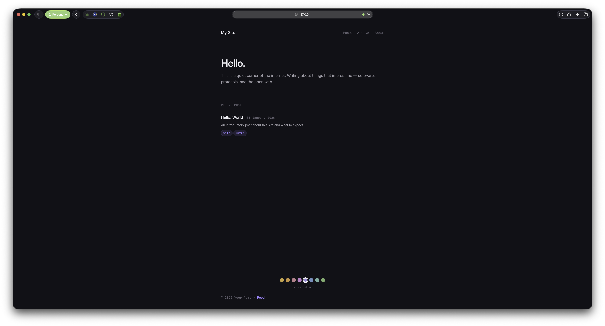

# Zola Standard Site

A Zola theme for long-form publishing on AT Protocol. Committed-dark reading surface, Inter + JetBrains Mono typography, 96 built-in colour themes, and standard.site verification that degrades gracefully.

## Quick start

```bash
# Install Zola (macOS)
brew install zola

# Clone and serve
git clone https://github.com/ewanc26/zola-standard-site
cd zola-standard-site
zola serve
```

Open `http://127.0.0.1:1111`. The site works immediately — all AT Protocol fields have placeholders and the theme degrades cleanly.

## Features

- **96 colour themes** — 8 hue families × 4 moods (soft, neutral, vivid, deep) × 3 depths (dim, dark, darker). Pick from coloured dots in the footer. Persisted to localStorage.
- **Inter + JetBrains Mono** — sans-serif for prose and headings, monospace for dates, tags, code, and structural markers.
- **Table of contents** — auto-generated from headings, configurable depth.
- **Reading time** — estimated from word count, toggleable.
- **Code copy button** — hover to reveal, clipboard API, zero dependencies.
- **Syntax highlighting** — Giallo engine (Zola 0.22+), gruvbox-dark-medium by default, 65 themes available.
- **Pagination** — per-section, prev/next with page counter.
- **Archive page** — posts grouped by year, pullable from any section.
- **Social links** — SVG icons for GitHub, Mastodon, Bluesky, Twitter, Email. Configurable.
- **Back to top** — CSS-only, scroll-driven where supported.
- **AT Protocol native** — standard.site publication verification and document linking. All tags degrade when config values are placeholders.
- **RSS / Atom feed** — auto-generated.
- **Dark-only, flat elevation** — tonal layering + borders, no shadows.
- **Zero layout shift** — theme switcher, back-to-top, all interactive elements.
- **Responsive** — mobile, tablet, desktop, wide. Print stylesheet included.
- **Accessible** — skip link, semantic HTML, ARIA landmarks, keyboard navigation, reduced motion, WCAG AA contrast.

## File structure

```
.
├── config.toml              # Site config + theme extras + ATProto fields
├── theme.toml               # Theme metadata (makes this a redistributable theme)
├── content/
│   ├── _index.md            # Homepage
│   ├── posts/
│   │   ├── _index.md        # Posts section (paginate_by here)
│   │   └── hello-world.md   # Example post
│   └── archive/
│       └── _index.md        # Archive (pulls from posts section)
├── templates/
│   ├── base.html            # Root layout — fonts, CSS, skip link, footer, JS
│   ├── index.html           # Homepage — intro + recent posts
│   ├── section.html         # Post listing with pagination
│   ├── page.html            # Single post — ToC, reading time, prev/next
│   ├── archive.html         # Year-grouped archive
│   ├── 404.html             # Error page
│   ├── taxonomy_list.html   # Tag index
│   ├── taxonomy_single.html # Posts per tag
│   └── shortcodes/
│       ├── image.html       # Responsive image with lazy loading
│       ├── callout.html     # note / warning / tip
│       └── youtube.html     # Responsive embed
├── static/
│   ├── css/
│   │   ├── dark-study.css   # Main stylesheet — tokens, layout, components
│   │   └── themes-64.css    # 96-theme colour definitions (generated)
│   └── og-default.svg       # Reference OG image design
├── scripts/
│   └── generate-themes.mjs    # Theme generator (8 hues × 4 moods × 3 depths)
├── .github/workflows/
│   └── publish.yml            # CI: Sequoia publish → Zola build → deploy
├── sequoia.example.json       # Template for Sequoia config
├── DESIGN.md                  # Visual design system (Stitch format)
└── PRODUCT.md                 # Strategic product brief
```

## Configuration

### Theme settings (`config.toml` `[extra]`)

```toml
[extra]
author = "Your Name"
show_author = true
show_reading_time = true
toc_depth = 2
theme_default = "amber-soft-dark"

nav_items = [
  { name = "Posts", url = "/posts" },
  { name = "Archive", url = "/archive" },
  { name = "About", url = "/about" },
]

socials = [
  { name = "GitHub",   url = "https://github.com/", icon = "github" },
  { name = "Mastodon", url = "https://", icon = "mastodon" },
  { name = "Bluesky",  url = "https://", icon = "bluesky" },
]

og_image = "https://example.com/og.png"
```

### AT Protocol (standard.site)

Fill in the three fields in `config.toml` after creating your publication record:

```toml
atproto_did = "did:plc:yourdid"
standard_site_publication_rkey = "self"
standard_site_publication_at_uri = "at://did:plc:yourdid/site.standard.publication/self"
```

For each post, add the document rkey to its frontmatter:

```toml
[extra]
standard_site_document_rkey = "3lwafzkjqm25s"
```

Until these are filled in, the standard.site `<link>` tags are suppressed — nothing breaks.

### Pagination

Set `paginate_by` in section `_index.md` frontmatter:

```toml
+++
title = "Posts"
sort_by = "date"
paginate_by = 10
template = "section.html"
page_template = "page.html"
+++
```

### Syntax highlighting

Pick any [Giallo theme](https://github.com/getzola/giallo?tab=readme-ov-file#built-in) (65 available):

```toml
[markdown.highlighting]
theme = "gruvbox-dark-medium"
```

## AT Protocol publishing (Sequoia)

This theme is wired for [Sequoia](https://sequoia.pub), the CLI that publishes static Markdown blogs to AT Protocol.



The handshake:

1. **Sequoia writes rkeys** to post frontmatter after creating records on your PDS
2. **Zola reads them** during build and emits `<link rel="site.standard.document">` tags
3. **AT Protocol indexers** discover the links and surface your content

### Setup

```bash
# Install and init (creates sequoia.json, registers publication)
npx sequoia-cli init

# Fill in config.toml ATProto fields with values from sequoia.json
# atproto_did → your DID
# standard_site_publication_at_uri → publicationUri from sequoia.json

# Publish posts to AT Protocol
npx sequoia-cli publish
```

Sequoia walks `content/`, creates a `site.standard.document` record per post, and writes the rkey back to the post's frontmatter under the `standard_site_document_rkey` field — the exact field our `page.html` template reads.

### CI automation

`.github/workflows/publish.yml` is included — it runs Sequoia before the Zola build on every push to main. Add two repo secrets:

- `ATPROTO_HANDLE` — your Bluesky handle (e.g. `you.bsky.social`)
- `ATPROTO_APP_PASSWORD` — an app password from Bluesky settings

The workflow commits any rkey changes back to the repo and builds the site.

### How the template uses it

```
Sequoia writes → page.extra.standard_site_document_rkey = "3lwafzkjqm25s"
                   ↓
page.html reads → page.extra.standard_site_document_rkey
                   ↓
            emits → <link rel="site.standard.document"
                         href="at://did:plc:xxx/site.standard.document/3lwafzkjqm25s">
```

When config values are still placeholders (containing `YOURDIIDHERE`), the link tag is suppressed — nothing breaks.

## Shortcodes

```tera
{{/* image(path="img/photo.jpg", alt="Description", caption="Optional") */}}
{{/* callout(type="note|warning|tip", title="Heads up") */}} content {{/* callout_end() */}}
{{/* youtube(id="dQw4w9WgXcQ") */}}
```

## Adding a theme

The 96 themes are generated by `scripts/generate-themes.mjs`. To add a hue, mood, or depth:

1. Edit the `HUES`, `MOODS`, or `DEPTHS` array in the script
2. Run `node scripts/generate-themes.mjs`
3. Update the `STEPS` array in `templates/base.html` to match

All colour tokens are CSS custom properties under `[data-theme="name"]` selectors. The theme switcher sets `data-theme` on `<html>` and persists to `localStorage`.

## Design

See `DESIGN.md` for the full visual system (Stitch format with YAML frontmatter). See `PRODUCT.md` for the strategic brief. The design language is drawn from the Croft ecosystem: devlog (colour), faol-website (elevation, tags), inkwell (typography, motion), website (tokens).

## License

AGPL-3.0
